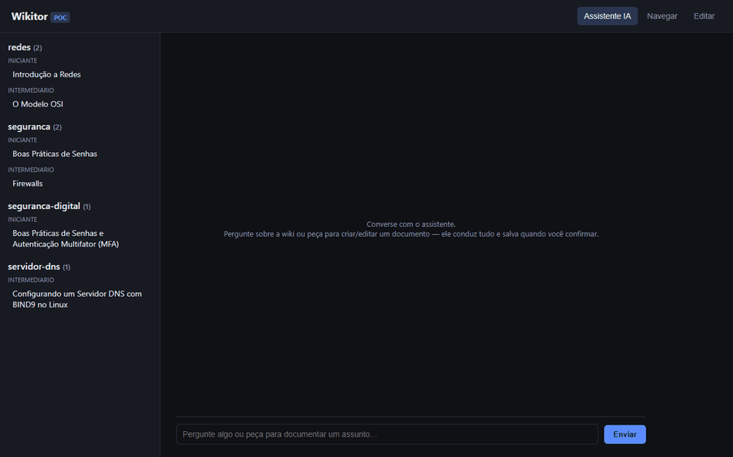

# Wikitor

Wiki de conhecimento baseada em documentos **Markdown**, com uma **cadeia de índices
gerada por LLM** (master → assunto → nível de maturidade) e um **assistente conversacional**
que responde perguntas (citando fontes) e conduz a autoria de novos documentos.

> **Status atual:** existe uma **implementação funcional em estágio de POC** — local, sem
> Azure, sem autenticação, usando Ollama como LLM. O **design completo** (multitenant, Azure
> Storage, AKS, MCP-server, controle de acesso) está documentado em `docs/design/` e ainda não
> foi implementado.



## O que é

- **Conteúdo:** cada documento é um arquivo `.md` com frontmatter (assunto, nível, título,
  resumo) — o frontmatter é a fonte da verdade.
- **Índices:** derivados automaticamente a cada save (não editados manualmente). Formam uma
  cadeia de duas dimensões:
  - **Profundidade:** índice raiz (`_master.json`) → índice por assunto → documento.
  - **Maturidade:** `iniciante` / `intermediario` / `avancado`.
- **Sem busca vetorial:** o retrieval é por navegação na cadeia de índices, não por embeddings.
- **Assistente IA unificado:** uma única conversa que infere a intenção da mensagem e roteia
  entre três comportamentos —
  1. **perguntar** → responde com base nos documentos existentes, citando a fonte;
  2. **autorar** → conduz uma entrevista guiada para reunir contexto antes de escrever;
  3. **salvar** → ao confirmar, gera o markdown final, infere assunto/nível, grava o
     arquivo e reindexa.

## Como funciona (POC)

```
┌──────────────┐     ┌──────────────────────────────┐     ┌──────────────┐
│  Front-end   │────▶│  FastAPI backend              │────▶│   Ollama     │
│  (estático)  │     │  - storage local (markdown)   │     │  (LLM local) │
│  Navegar /   │     │  - indexer (gera resumo/índice)│     └──────────────┘
│  Editar /    │     │  - assistente (Q&A/autoria/    │
│  Assistente  │     │    save em uma única conversa) │
└──────────────┘     └──────────────────────────────┘
```

Não há autenticação, multitenancy ou Azure nessa fase — o objetivo da POC é validar a
experiência de navegação, autoria assistida e a cadeia de índices antes de investir na
infraestrutura completa.

## Como configurar e executar

Pré-requisitos:

- Python 3.11+
- [uv](https://docs.astral.sh/uv/) para gerenciar dependências do backend
- Node 20+ para o front-end React (`webapp/`)
- [Ollama](https://ollama.com/) rodando em `http://localhost:11434` com um modelo
  baixado (padrão: `gemma4:e2b`)

```powershell
# Backend
cd backend
make install   # uv sync — instala dependências de prod + dev
make run       # uvicorn app.main:app --reload --port 8000

# Front-end (React) — em outro terminal
cd webapp
npm install
npm run dev    # http://localhost:5173 (proxy /api -> :8000)
```

Em dev, abra http://localhost:5173 — a aba **Assistente IA** já abre conversando; **Navegar**
lista os documentos existentes; **Editar** permite edição manual de markdown. Para servir o
front-end pelo próprio backend, rode `npm run build` no webapp e acesse http://localhost:8000.

Veja [`docs/README.md`](docs/README.md) e [`webapp/README.md`](webapp/README.md) para a
lista completa de variáveis de ambiente e dos comandos de desenvolvimento (backend e front-end).

## Estrutura do repositório

```
wikitor/
  docs/design/                  documento de design completo + plano de implementação
  backend/app/                  FastAPI em onion architecture (domain/application/
                                 infrastructure/presentation)
  backend/skills/                instruções estilo SKILL.md usadas como system prompt
  content/docs/                 documentos markdown (fonte da verdade)
  content/indices/              índices derivados (_master.json, {assunto}.json)
  webapp/                       front-end React + Vite (Assistente IA, Navegar, Editar)
```

## Documentação de design

A POC implementa um subconjunto do design completo. Para a visão de produção —
multitenancy, Azure Storage, AKS, Microsoft Entra ID, MCP-server para agentes externos,
fluxo de revisão híbrido e controle de acesso — veja:

- [`docs/design/wikitor-design.md`](docs/design/wikitor-design.md) — design completo
  (decisões, modelo de dados, componentes, segurança, estratégia de testes).
- [`docs/design/implementation-plan.md`](docs/design/implementation-plan.md) — plano de
  implementação faseado derivado do design.
