# Edição assistida — fluxo de edição (diagrama de sequência)

> Artefato de design (em brainstorming) para corrigir o bug em que, ao editar um
> documento aberto via "editar com IA" e pedir um conteúdo novo na conversa, o novo
> conteúdo sobrescreve o arquivo antigo. Introduz a **árvore de documentos em edição**,
> o **roteamento inferido pela IA**, a **proposta de novo documento**, a **afinidade
> índice↔arquivo** e o **save em duas fases com confirmação conversacional**.

## Decisões refletidas no fluxo

- **Gatilho de novo documento:** a IA detecta conteúdo que não pertence ao documento em
  foco e **propõe** criar um novo nó; só cria após confirmação do usuário.
- **Roteamento:** a IA infere a qual documento da árvore cada mensagem se aplica; o
  usuário confere visualmente na árvore (agrupada por índice/assunto → documento).
- **Escopo do save:** apenas os documentos que mudaram entram no plano.
- **Afinidade:** ao montar o plano, a IA infere o assunto do conteúdo; se divergir do
  assunto do arquivo-alvo, **redireciona** automaticamente para um arquivo sob o assunto
  correto (A), exibido no plano de confirmação.
- **Confirmação:** conversacional — a IA envia o plano por mensagem e o usuário confirma
  respondendo por mensagem.
- **Save em duas fases:** `/ai/assistant` **propõe** o plano; `/docs/commit` **grava** o
  plano já confirmado (o texto confirmado é o gravado). Backend permanece sem estado; a
  árvore é estado de sessão do cliente, enviada como contexto a cada turno.
- **Plano editável por mensagem (A):** se a resposta à confirmação não for confirmar nem
  cancelar, a IA reinterpreta o pedido, **remonta o plano** e reapresenta para nova
  confirmação.
- **Aviso de afinidade durante a edição (B):** além da checagem no plano, a IA **sinaliza
  a deriva de assunto durante a conversa**, assim que percebe — exibida como alerta no nó.

## Diagrama de sequência

```mermaid
sequenceDiagram
    autonumber
    actor U as Usuário
    participant W as WebApp (chat + árvore)
    participant A as API /ai/assistant
    participant L as LLM (Ollama)
    participant C as API /docs/commit
    participant S as Storage (docs + índices)

    rect rgb(20,28,48)
    note over U,W: Abrir documento existente para edição
    U->>W: "editar com IA" em redes/osi
    W->>A: getDocument(redes/osi)
    A->>S: read_document(redes/osi)
    S-->>A: doc
    A-->>W: doc
    W->>W: árvore += nó {redes/osi, estado:intocado, em foco}
    end

    rect rgb(18,34,26)
    note over U,L: Editar o documento em foco
    U->>W: "melhora a seção de camadas"
    W->>A: POST /ai/assistant {messages, árvore}
    A->>L: classificar intenção + documento-alvo
    L-->>A: intenção=autorar, alvo=redes/osi
    A->>L: coautoria_chat(contexto = redes/osi)
    L-->>A: resposta
    A-->>W: {acao:autoria, alvo:redes/osi, resposta}
    W->>W: nó redes/osi passa a estado:alterado
    end

    rect rgb(40,30,18)
    note over U,L: Conteúdo novo (IA propõe, usuário confirma)
    U->>W: "agora documenta firewalls"
    W->>A: POST /ai/assistant
    A->>L: classificar intenção + alvo
    L-->>A: conteúdo NÃO pertence ao doc em foco (assunto: seguranca)
    A-->>W: {acao:propor_novo_doc, sugestao:{seguranca, Firewalls}}
    W-->>U: "Parece um novo documento (assunto seguranca). Criar?"
    U->>W: "sim"
    W->>A: POST /ai/assistant (confirma criação)
    A-->>W: {acao:autoria, novo_no:{seguranca, Firewalls, id:null}}
    W->>W: árvore += nó {seguranca/Firewalls, estado:novo, em foco}
    end

    rect rgb(34,22,40)
    note over U,S: Pedir para salvar, plano (afinidade) e confirmação
    U->>W: "pode salvar"
    W->>A: POST /ai/assistant
    A->>L: classificar intenção
    L-->>A: salvar
    loop para cada nó {alterado, novo}
        A->>L: inferir assunto do conteúdo
        L-->>A: assunto inferido (A)
        A->>A: afinidade do assunto vs arquivo, redireciona p/ A se divergir
    end
    A-->>W: {acao:plano_save, plano:[{id, assunto, arquivo, tipo, redirecionado?}]}
    W-->>U: "Vou gravar: seguranca/firewalls (novo), redes/osi (atualiza). Confirma?"
    end

    rect rgb(16,38,40)
    note over U,S: Confirmação conversacional e commit
    U->>W: "confirmo"
    W->>C: POST /docs/commit {plano}
    loop para cada item do plano
        C->>L: gerar_resumo(titulo, conteudo)
        L-->>C: resumo
        C->>S: write_document(arquivo correto)
    end
    C->>S: rebuild_indices()
    S-->>C: master atualizado
    C-->>W: {salvos:[...]}
    W->>W: nós passam a estado:salvo/intocado, recarrega índice + árvore
    end
```



## Modelo de dados

### Árvore de edição (estado de sessão do cliente)

```ts
type Estado = 'intocado' | 'alterado' | 'novo';

interface EditNode {
  nodeId: string;          // uuid do cliente
  assunto: string;         // índice atual do nó
  docId: string | null;    // null = documento novo (sem arquivo)
  titulo: string;
  nivel: Nivel;
  baseConteudo: string;    // conteúdo da última carga/gravação (baseline p/ "alterado")
  conteudo: string;        // conteúdo de trabalho atual
  emFoco: boolean;
  driftAssunto?: string;   // assunto sugerido pela IA ao perceber deriva (B)
}
// estado derivado: docId == null -> 'novo'; conteudo != baseConteudo -> 'alterado'; senão 'intocado'.
```

A árvore é agrupada por `assunto` na UI. **Não é persistida no servidor** — recarregar a
página a perde (os documentos salvos persistem normalmente).

### Plano de gravação (snapshot do que será gravado)

```ts
interface SavePlanItem {
  nodeId: string;
  assunto: string;          // assunto final (após afinidade)
  docId: string | null;     // id final; null -> backend gera no commit
  arquivo: string;          // caminho previsto docs/{assunto}/{slug}.md
  titulo: string;
  nivel: Nivel;
  tipo: 'novo' | 'atualiza';
  redirecionado: boolean;   // afinidade mudou o destino (A em arquivo de B)
  conteudo: string;         // TEXTO que será gravado (snapshot confirmado)
}
interface SavePlan { itens: SavePlanItem[]; }
```

O `conteudo` viaja dentro do plano para garantir que **o texto confirmado é exatamente o
gravado** (sem reinferência entre propor e gravar).

## Contratos de API

### `POST /api/ai/assistant` (turno do assistente — propõe, nunca grava)

Request:
```ts
{
  messages: ChatMessage[];
  arvore: EditNode[];            // nós com assunto, docId, titulo, nivel, conteudo
  foco: string | null;          // nodeId em foco
  plano_pendente?: SavePlan | null;   // se há plano aguardando confirmação
  proposta_pendente?: { assunto: string; titulo: string; nivel: Nivel } | null;
}
```

Response (`acao`):
- `resposta` — Q&A com fontes (inalterado).
- `autoria` — `{ alvo: nodeId, resposta, conteudo?, drift?: { nodeId, assuntoSugerido } }`:
  turno de edição; pode atualizar o conteúdo do nó-alvo e sinalizar deriva de assunto (B).
- `propor_novo_doc` — `{ resposta, sugestao: { assunto, titulo, nivel } }`: a IA acha que o
  conteúdo não pertence ao foco; o cliente só cria o nó após confirmação (próximo turno).
- `plano_save` — `{ resposta, plano: SavePlan }`: changeset proposto (já com afinidade);
  o cliente guarda como `plano_pendente`.
- `confirmado` — `{ resposta, plano: SavePlan }`: o usuário confirmou; o cliente chama o
  commit com esse plano.
- `cancelado` — `{ resposta }`: plano/proposta descartados.

> Roteamento da confirmação: quando há `plano_pendente`, o backend classifica a resposta do
> usuário em **confirmar** (`confirmado`) / **ajustar** (novo `plano_save`) / **cancelar**
> (`cancelado`). Idem para `proposta_pendente` (criar/!criar).

### `POST /api/docs/commit` (grava o plano confirmado — a única rota que escreve)

Request: `{ plano: SavePlan }`. Para cada item:
1. **Afinidade (guarda dura):** o destino é sempre `docs/{assunto}/{slug}.md`. Se
   `tipo == 'atualiza'` mas o prefixo de `docId` ≠ `assunto`, o item é tratado como **novo**
   sob `assunto` (`new_doc_id(assunto, titulo)`) — **nunca** sobrescreve o arquivo de outro
   assunto. Esta é a correção central do bug.
2. `gerar_resumo(titulo, conteudo)`.
3. `write_document(...)` no arquivo correto.

Ao final, `rebuild_indices()` **uma vez**. Response: `{ salvos: [{ nodeId, id, assunto, titulo }] }`.

## Tratamento de erros e casos de borda

- **Falha de classificação/JSON do LLM:** falha segura — nunca grava; o turno vira `autoria`
  ou o plano não é montado, e o erro aparece como mensagem.
- **Nó novo sem edição / intocado:** fica fora do plano (escopo "só os que mudaram").
- **Deriva de assunto em doc existente:** afinidade cria **arquivo novo** sob o assunto
  correto e **deixa o arquivo antigo intacto** (não há move/delete automático nesta fase).
- **Colisão de slug:** resolvida por `new_doc_id` (sufixo `-2`, `-3`, …).
- **Correção de roteamento:** se a IA mirar o nó errado, o usuário corrige por mensagem e o
  próximo turno re-roteia.

## Estratégia de testes

- **pytest (backend):**
  - *Regressão do bug:* doc existente em foco + conteúdo novo não relacionado + salvar →
    o arquivo semeado **não** é sobrescrito; cria-se um novo sob o assunto inferido.
  - *Afinidade:* `tipo=atualiza` com `assunto` ≠ prefixo do `docId` → grava como novo.
  - *Commit:* grava só os itens do plano e chama `rebuild_indices` uma vez.
- **Vitest (frontend):** transições de estado do nó (intocado→alterado), render do plano,
  confirmação dispara commit com o snapshot.
- **Playwright (e2e):** abrir doc → pivotar para tema novo → confirmar proposta de novo doc
  → salvar → confirmar → dois arquivos distintos resultantes.

## Decision Log

| # | Decisão | Alternativas | Por quê |
|---|---------|--------------|---------|
| 1 | Novo doc: IA propõe, usuário confirma | Ação explícita; IA infere sozinha | Equilíbrio fluidez/segurança; evita a inferência cega que causou o bug |
| 2 | Roteamento: IA infere alvo + árvore para conferência visual | Foco explícito; thread por doc | Mantém fluidez; a árvore dá visibilidade sem travar o fluxo |
| 3 | Save grava só os documentos que mudaram | Todos da árvore; seleção manual | Evita reescrever intocados e inflar a confirmação |
| 4 | Afinidade: redireciona automaticamente para A | Bloquear; só avisar | Menos atrito; o destino aparece no plano e o usuário confirma |
| 5 | Assunto inferido do conteúdo a cada save | Vínculo fixo; sempre manual | Capta deriva real; mitigado pela confirmação obrigatória |
| 6 | Confirmação conversacional (mensagem ↔ mensagem) | Modal; badges na árvore | Preserva a identidade "tudo na conversa" |
| 7 | Save em duas fases (`/ai/assistant` propõe, `/docs/commit` grava) | Save num passo só | Garante que o texto confirmado é o gravado; backend sem estado |
| A | Plano editável por mensagem | Confirmação binária | Mais flexível; ajustes sem sair do fluxo |
| B | Afinidade sinalizada também durante a edição | Só no plano | Avisa cedo; custo extra de LLM por turno aceito na POC |

## Plano de implementação (faseado)

> **Fase 0 — Backend stateless tree-aware (núcleo da correção)**
> 1. `models.py`: `EditNodeIn`, `SavePlan`, `SavePlanItem`, request estendido do assistant.
> 2. `ai.py`: classificador de intenção ciente de `plano_pendente`/`proposta_pendente`;
>    roteamento de alvo; `propor_novo_doc`; montagem de `plano_save` com inferência de
>    assunto + afinidade; sinal de `drift` no `autoria` (B).
> 3. `main.py`: novo `POST /api/docs/commit` com a **guarda dura de afinidade**; manter
>    `/api/docs` manual como está.
> 4. pytest: regressão do bug + afinidade + commit.

> **Fase 1 — Frontend: árvore de edição + fluxo conversacional**
> 5. `useAssistant`: passar a gerir `tree`, `foco`, `planoPendente`, `propostaPendente`;
>    aplicar cada `acao`; disparar `/docs/commit` no `confirmado`.
> 6. Componente `EditTree` acima do input (grupos por assunto, badges de estado, foco,
>    alerta de deriva).
> 7. `api.ts`/`types.ts`: tipos e chamadas novas.
> 8. Vitest dos estados e do fluxo de plano.

> **Fase 2 — Validação ponta a ponta**
> 9. Playwright do golden path (pivot + novo doc + save em dois arquivos).
> 10. `npm run check` + `make check` verdes.

## Status

Understanding Lock **confirmado**; decisões 1–7 + A/B aceitas; decision log completo.

- **Fase 0 (backend) — concluída.** `affinity_target` (guarda dura), models do plano/árvore,
  `assistente_arvore` em `ai.py`, endpoint `POST /api/docs/commit`, e pytest (regressão do
  bug + afinidade + commit). Gate do backend verde (ruff + complexipy + pytest). O fluxo
  legado de `/api/ai/assistant` segue ativo até a Fase 1 ligar o frontend ao modo árvore.
- **Fase 1 (frontend) — concluída.** Tipos e `api.assistantTree`/`api.commit`; `useAssistant`
  reescrito ciente da árvore (foco, plano e proposta pendentes, commit no `confirmado`);
  componente `EditTree` acima do input (grupos por assunto, badges de estado, foco, alerta de
  deriva); `App.editWithAI` adiciona o doc à árvore. Vitest do fluxo (addDocNode, autoria→
  alterado, confirmado→commit). Gate do frontend verde (lint + testes + build).
  - *Nota de integração:* o conteúdo de cada nó é sintetizado da conversa no momento do plano
    (como no fluxo legado); a árvore exibe identidade/estado, não o texto completo. Árvore vazia
    + autoria cria um nó de trabalho automaticamente (não há arquivo a proteger).
- **Fase 2 (e2e)** — pendente: Playwright do golden path (pivot → novo doc → dois arquivos).

### Remoção de artigos (arquivar + excluir)

Adicionada como operação de primeira classe ao lado de adicionar/editar, motivada por
obsolescência. Decisões: **arquivar** (soft delete reversível — `status='arquivado'`, sai do
índice mas o arquivo permanece) **e excluir** (hard delete — apaga o `.md`); disponível na
**aba Navegar** (links "arquivar"/"excluir" com confirmação) **e via Assistente** (entra no
plano de confirmação como item `tipo: remover|arquivar`).

- Backend: `storage.delete_document`/`set_status`; rotas `DELETE /api/docs/{id}`,
  `POST /api/docs/{id}/archive`, `POST /api/docs/{id}/restore`; `commit` aplica os tipos
  `remover`/`arquivar`; `ai.assistente_arvore` detecta o pedido e monta o plano. pytest cobre
  delete/archive/restore + commit-remover.
- Frontend: `api.deleteDocument/archiveDocument/restoreDocument`; ações na `BrowseView`;
  o commit da árvore remove o nó removido/arquivado. Vitest do commit de remoção.
- **Follow-ups conhecidos:** (1) não há UI para listar/restaurar arquivados (ficam fora do
  índice); (2) o arquivo órfão do redirect de afinidade ainda não é limpo automaticamente.

### Lixeira com retenção de 30 dias

"Excluir" deixou de ser hard delete imediato: agora **move o arquivo para a lixeira**
(`content/trash/`), recuperável, e a **exclusão definitiva só é liberada após 30 dias**
(`config.TRASH_RETENTION_DAYS`). Distinto de "arquivar" (que mantém o arquivo no lugar).

- Backend: `storage.trash_document`/`read_trash`/`list_trash`/`restore_from_trash`/
  `purge_document` (guarda dos 30 dias via `dias_na_lixeira`); `excluido_em` no frontmatter;
  rotas `POST /api/docs/{id}/trash`, `GET /api/trash`, `POST /api/trash/{id}/restore`,
  `DELETE /api/trash/{id}` (409 antes da retenção). O commit do assistente (`tipo: remover`)
  passou a mover para a lixeira. pytest cobre trash/list/restore/purge (cedo e após retenção).
- Frontend: aba **Lixeira** (lista com dias restantes, restaurar, e "excluir definitivamente"
  habilitado só quando elegível); "excluir" na Navegar agora envia para a lixeira.
- *Nota:* a lixeira é dados de runtime (`content/trash/`, no `.gitignore`). Não há
  purge automático agendado — a exclusão definitiva é manual (e bloqueada antes dos 30 dias).
